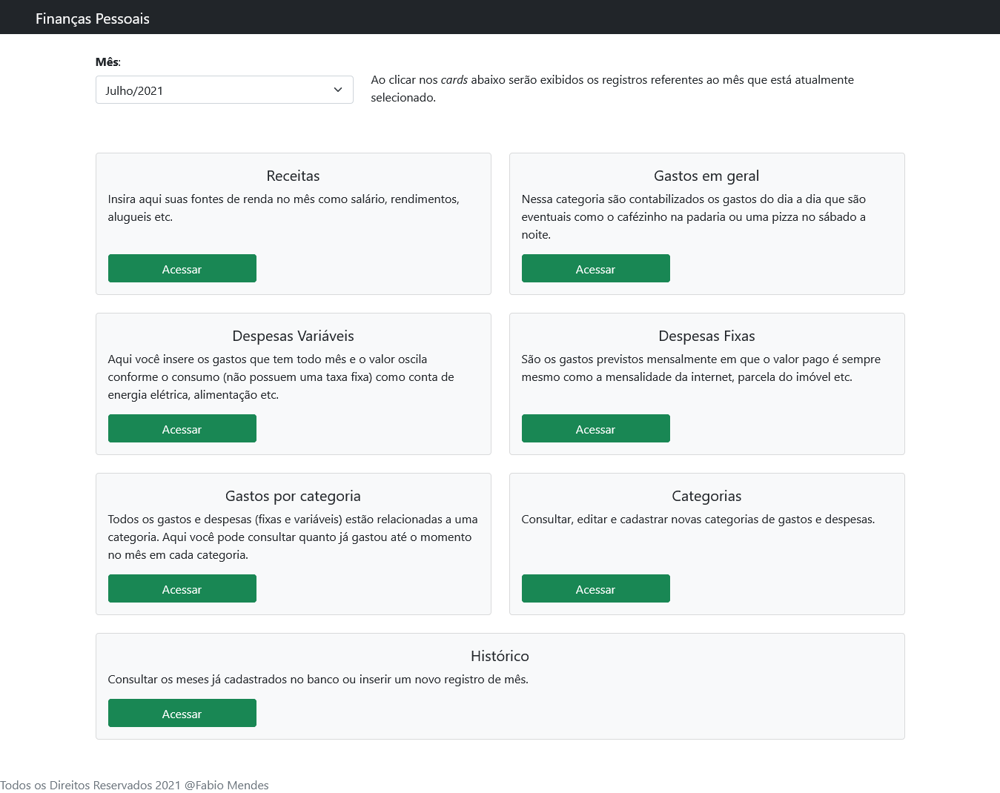
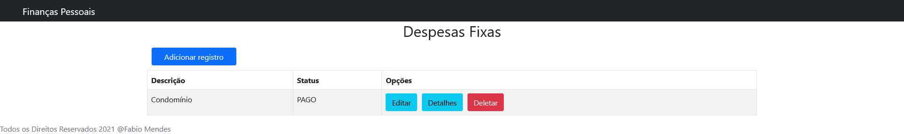
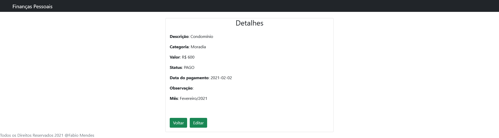
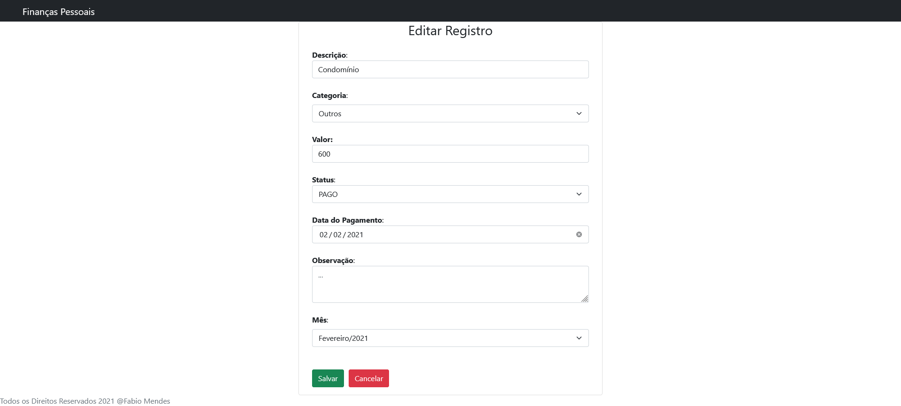
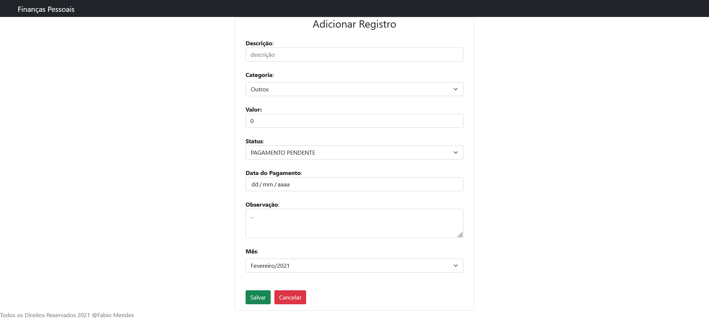
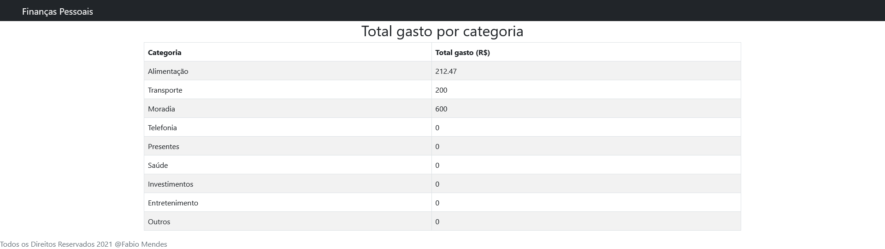

# Sistema de finanças pessoais

Esse projeto foi apresentado na disciplina de Linguagem de Programação 3 e é uma maneira simples de gerenciar suas finanças pessoais.
Foi criada uma API REST usando Java e uma interface web usando React. Para persistência dos dados foi utilizado o banco de dados MySQL.

Observação: Para facilitar a visualização e navegação os nomes das classes citadas a seguir são links para visualizar os arquivos.

## Sobre o sistema

### Visão Geral

O sistema foi desenvolvido aplicando alguns conceitos de educação financeira que é importante explicar antes de entrar em detalhes nas entidades e classes, são eles:

- **Despesas Fixas**: São todos os gastos mensais, onde o valor a ser pago é sempre o mesmo, são os gastos mais previsíveis.

- **Despesas variáveis**: São gastos mensais onde o valor a ser pago oscila conforme o consumo, são menos previsíveis.

- **Gastos em Geral**: Gastos que acontecem no dia a dia e que não são planejados como, por exemplo, trocar o pneu do carro.

Cada um dos tópicos acima foi abstraído como uma entidade, por isso possuem suas classes homônimas no pacote model.

Cada um dos registros das entidades citadas possuem uma categoria associada (Ex.: alimentação, transporte, moradia etc.) e isso possibilita que o sistema contabilize quanto já foi gasto com cada categoria. Categoria também é uma entidade no sistema.

Outra entidade são as receitas, tudo que o usuário recebeu é registrado como uma receita (como salário, retorno de investimentos etc.).

Toda a aplicação foi pensada e organizada considerando um período comum de organização nas finanças pessoais: o mês. A grande maioria das pessoas se organiza financeiramente com base em ciclos de 30 dias aproximadamente. Levando isso em consideração, todos os registros de Despesas Fixas, Despesas Variáveis, Gastos e Receitas estão relacionados a um mês.

### Organização

Foi aplicado o design pattern MVC para a organização das responsabilidades nas classes, logo temos:

* Controllers: Onde estão definidos os endpoints da API;
* Exceções: Classe de exceções personalizadas;
* Models: as classes que abstraem as entidades;
* Repository: Como foi utilizado o Hibernate para fazer o acesso aos dados, cada controller possui um repository associado para se comunicar com a tabela da entidade.

Obs.: Foi utilizado o plugin Lombok, que cria métodos comuns como getters, setters e construtores automaticamente a partir de anotações nas classes.

### Funcionamento

Tela inicial:



Logo no início da página há um dropdownlist para selecionar um dos meses que já estão cadastrados no banco de dados.

Ao clicar nos cards da página referentes a receitas, gastos em geral, despesas variáveis, despesas fixas e gastos por categoria são exibidos os registros nas tabelas dessas entidades filtrados pelo mês selecionado.

A exceção são os cards de categorias e de histórico (mostra os meses já salvos), que exibem todos os registros salvos, independente do mês selecionado.

As operações possíveis de se fazer são basicamente as mesmas para todas as tabelas (exceto gastos por categorias) e compreendem as operações básicas CRUD (Create, Read, Update e Delete) e em algumas são exibidos também detalhes. Por serem operações e telas semelhantes, as imagens a seguir são referentes a Despesas fixas:



Detalhes do registro:



Edição de um registro:



Adicionar um novo registro:



Nos gastos por categoria é possível consultar em despesas fixas, variáveis e gastos em geral quanto já foi gasto em cada categoria. Veja:



Ao adicionar novos gastos e marcá-los como "PAGO" eles são automaticamente contabilizados e o usuário consegue saber qual a distribuição de seus gastos em cada categoria.

## Aplicação dos conteúdos da disciplina de Linguagem de Programação 3

Os controllers muitas vezes são responsáveis por gerar exceções quando, por exemplo, uma requisição é recebida e o recurso que se procura não existe no banco de dados. Para tratar essas situações de forma legível e menos prolixa apliquei os conceitos de **programação funcional** para o lançamento das exceções.

Para exemplificar está abaixo o método ```getReceitaById()``` ([```ReceitaController```](https://github.com/fabioTowers/financas/blob/main/src/main/java/com/example/financas/controller/ReceitaController.java "Ver na classe")) que recebe um id de um registro de receita e devolve o objeto correspondente. No caso de uma consulta por um id que não existe no banco será lançada uma exceção com uma mensagem personalizada:

```java
// Consultar uma receita pelo ID
@GetMapping("/receita/{id}")
public ResponseEntity<Receita> getReceitaById(@PathVariable Long id){
	Receita receita = recRepo.findById(id).orElseThrow(() -> new ResourceAccessException(
				"[getReceitaById] Não registro de receita com o id informado: " + id));
	return ResponseEntity.ok(receita);
}
```
A mesma técnica acima foi empregada extensivamente nos demais controllers da aplicação.

A funcionalidade de contabilizar os gastos por categoria foi implementada no back-end na classe [```EstatisticasController```](https://github.com/fabioTowers/financas/blob/main/src/main/java/com/example/financas/controller/EstatisticasController.java "Ver classe") que acessa múltiplas tabelas do banco de dados filtrando seus registros pelo mês especificado na requisição.

Um ponto importante para implementar essa funcionalidade é que ela envolve basicamente 3 tabelas do banco de dados:

* Gastos gerais;
* Despesas fixas e,
* Despesas variáveis.

Nessas três tabelas devem ser primeiramente selecionados apenas os registros relacionados ao mês especificado na requisição. Como a mesma operação é feita nas três tabelas foi criada a classe [```ListaPorMes```](https://github.com/fabioTowers/financas/blob/main/src/main/java/com/example/financas/controller/ListaPorMes.java "Ver classe") no pacote dos controllers, e sua função é retornar a lista de registros de cada tabela, isso também proporcionou maior **reutilização** e um **código limpo**.

Entretanto as tabelas são classes diferentes na aplicação, como um mesmo método poderia tratar isso?

O construtor não sabe qual classe vai receber e manipular, pois isso é definido em tempo de execução, por isso foram aplicados conceitos de **metaprogramação**. No construtor a classe recebe apenas uma classe genérica e um objeto, além do mês, como a seguir:

```java
public ListaPorMes(Class<?> classe, Object obj, MesAno mes) {
	this.classe = classe;
	this.obj = obj;
	this.mes = mes;
}
```

A consulta dos registros nas três tabelas (gastos em geral, despesas fixas e variáveis) é realizada simultaneamente na classe [```EstatisticasController```](https://github.com/fabioTowers/financas/blob/main/src/main/java/com/example/financas/controller/EstatisticasController.java "Ver classe") usando o conceito de **thread**, como é necessário que a aplicação aguarde essa consulta para continuar o processamento é utilizado o método **```join()```** para aguardar as threads finalizarem. A seguir a implementação em [```EstatisticasController```](https://github.com/fabioTowers/financas/blob/main/src/main/java/com/example/financas/controller/EstatisticasController.java "Ver classe"):

```java
/*O mesmo método recebe em seu construtor 3 classes e objetos diferentes com apenas uma implementação e sem sobrecrita*/
ListaPorMes gastos = new ListaPorMes(GastosGeraisRepository.class, ggRepo, mesAno);
ListaPorMes despFixa = new ListaPorMes(DespesasFixasRepository.class, dfRepo, mesAno);
ListaPorMes despVar = new ListaPorMes(DespesasVariaveisRepository.class, dvRepo, mesAno);

/*Iniciadas novas threads*/
Thread gastosThread = new Thread(gastos);
Thread despFixaThread = new Thread(despFixa);
Thread despVarThread = new Thread(despVar);

/*Inicio da execução das threads (execução do método run())*/
gastosThread.start();
despFixaThread.start();
despVarThread.start();

/*Garantir que a execução só vai prosseguir quando terminadas as consultas*/
try {
	despFixaThread.join();
	gastosThread.join();
	despVarThread.join();
} catch (InterruptedException e1) {
	e1.printStackTrace();
}

/*Inserção dos valores em variáveis para serem manipulados*/
List<GastoGeral> gastosNoMes = gastos.registrosAgrupadorPorMes();
List<DespesaFixa> despesasFixasNoMes = despFixa.registrosAgrupadorPorMes;
List<DespesaVariavel> despesasVariaveisNoMes = despVaregistrosAgrupadorPorMes();
```

No método ```run()``` na classe [```ListaPorMes```](https://github.com/fabioTowers/financas/blob/main/src/main/java/com/example/financas/controller/ListaPorMes.java "Ver classe") temos o sobrescrita do método na interface ```Runnable``` que realiza a busca dos registros filtrando por mês. Note que, independente do objeto e classe passada, o nome do método invocado é sempre o mesmo (```findByMesAno()```):

```java
@Override
public void run() {
	try {
		lista = (List) classegetDeclaredMethod("findByMesAno",MesAno.class).invoke(obj, mes);
	} catch (NoSuchMethodException e) {
		e.printStackTrace();
	} catch (Exception e) {
		e.printStackTrace();
	}
}
```

De volta a [```EstatisticasController```](https://github.com/fabioTowers/financas/blob/main/src/main/java/com/example/financas/controller/EstatisticasController.java "Ver classe"), após ter executado as operações descritas acima, é criada uma lista do tipo [```ValorCategoria```](https://github.com/fabioTowers/financas/blob/main/src/main/java/com/example/financas/model/ValorCategoria.java "Ver classe") (que possui um campo com nome da categoria e outro com o total gasto nela). A lista é preenchida com os valores de categorias que existem no banco, para isso é utilizada novamente a **programação funcional** que reduz drasticamente a quantidade de código se comparado com outras abordagens. Veja que a seguir são consultados todos os registros de categorias e para cada um deles é instanciado um novo objeto [```ValorCategoria```](https://github.com/fabioTowers/financas/blob/main/src/main/java/com/example/financas/model/ValorCategoria.java "Ver classe") com o campo de descrição preenchido com a categoria e o valor 0:

```java
List<ValorCategoria> totaisPorCategoria = catRepo.findAll().stream()
    .map(e -> new ValorCategoria(e.getDescricao(), (float) 0)).collect(Collectors.toList());
```

A lista criada é percorrida através de um laço ```for each``` e que a cada iteração manipula as listas de gastos, despesas fixas e variáveis como **streams**.

No caso de gastos o conteúdo da lista é filtrado pelos registros que correspondem a categoria atual no laço ```for each```, depois é recuperado o valor do registro e por último utiliza-se ```reduce``` para fazer a soma de todos os registros e o valor é armazenado em uma variável:

```java
total += gastosNoMes.stream()
    .filter(e -> e.getCategoria().getDescricao().contentEquals(c.getDescricao()))
    .map(e -> e.getValor())
    .reduce((float) 0, Float::sum);
```

Para as despesas fixas e variáveis o procedimento é basicamente o mesmo, entretanto, é necessário filtrar também pelos registros que estão marcados como "PAGO". Para realizar a soma em despesas variáveis foi utilizado ```reduce``` e nas despesas fixas ```forEach```:

```java
total += despesasVariaveisNoMes.stream()
    .filter(e -> e.getCategoria().getDescricao().contentEquals(c.getDescricao()))
    .filter(e -> e.getStatus().contentEquals("PAGO"))
    .map(e -> e.getValorPago())
    .reduce((float) 0, Float::sum);
```

```java
despesasFixasNoMes.stream()
    .filter(e -> e.getCategoria().getDescricao().contentEquals(c.getDescricao()))
    .filter(e -> e.getStatus().contentEquals("PAGO"))
    .forEach(e -> c.setValor(c.getValor() + e.getValor()));
```

Ao final da iteração a somatória é salva no campo valor da lista ```totaisPorCategoria``` e a variável que armazena as somas é zerada. Por fim o controller retorna a lista completa para exibição na view.

---

Após pronto o código foi **refatorado** em alguns pontos para ficar mais limpo e melhorar a qualidade não funcional do programa.

_Problema_: A maioria dos controllers possuem um endpoint utilizado para edição de registros que recebe o id do registro que deve ser atualizado e o novo objeto já atualizado com a edição. O problema é que utilizando os métodos ```getters``` e ```setters``` a código ficava mais extenso. A classe [```DespesaVariavelController```](https://github.com/fabioTowers/financas/blob/main/src/main/java/com/example/financas/controller/DespesaVariavelController.java "Ver classe"), por exemplo, possuía o seguinte código **antes da refatoração**:

```java
public ResponseEntity<DespesaVariavel> editarDespesaVariavel(@PathVariable Long id, @RequestBody DespesaVariavel despesaVariavelAtualizada) {

	DespesaVariavel despesaVariavel = dvRepo.findById(id).orElseThrow(() -> new ResourceAccessException("[editarDespesaVariavel] Não há despesa variavel com o ID informado: " + id));

	despesaVariavel.setCategoria(despesaVariavelAtualizada.getCategoria());
	despesaVariavel.setDataPagamento(despesaVariavelAtualizada.getDataPagamento());
	despesaVariavel.setDescricao(despesaVariavelAtualizada.getDescricao());
	despesaVariavel.setMesAno(despesaVariavelAtualizada.getMesAno());
	despesaVariavel.setObservacao(despesaVariavelAtualizada.getObservacao());
	despesaVariavel.setStatus(despesaVariavelAtualizada.getStatus());
	despesaVariavel.setValorPago(despesaVariavelAtualizada.getValorPago());
	despesaVariavel.setValorPlanejado(despesaVariavelAtualizada.getValorPlanejado());

	DespesaVariavel despesaVariavelNova = dvRepo.save(despesaVariavel);
	return ResponseEntity.ok(despesaVariavelNova);
}
```

O mesmo problema ocorria nos demais controllers.

_Solução_: Foi utilizada a técnica de refatoração **Extract Method** e o fragmanto de código dos ```getters``` e ```setters``` foi agrupado no método ```atualizarRegistro()``` na classe [```DespesaVariavel```](https://github.com/fabioTowers/financas/blob/main/src/main/java/com/example/financas/model/DespesaVariavel.java "Ver classe"), sua implementação:

```java
public void atualizarRegistro(DespesaVariavel novoRegistro) {
    this.setCategoria(novoRegistro.getCategoria());
    this.setDataPagamento(novoRegistro.getDataPagamento());
    this.setDescricao(novoRegistro.getDescricao());
    this.setMesAno(novoRegistro.getMesAno());
    this.setObservacao(novoRegistro.getObservacao());
    this.setStatus(novoRegistro.getStatus());
    this.setValorPago(novoRegistro.getValorPago());
    this.setValorPlanejado(novoRegistro.getValorPlanejado());
}
```

**Depois da refatoração** o código do método ```editarDespesaVariavel``` em [```DespesaVariavelController```](https://github.com/fabioTowers/financas/blob/main/src/main/java/com/example/financas/controller/DespesaVariavelController.java "Ver classe") ficou assim:

```java
public ResponseEntity<DespesaVariavel> editarDespesaVariavel(@PathVariable Long id, @RequestBody DespesaVariavel despesaVariavelAtualizada) {

	DespesaVariavel despesaVariavel = dvRepo.findById(id).orElseThrow(() -> new ResourceAccessException("[editarDespesaVariavel] Não há despesa variavel com o ID informado: " + id));
		
	despesaVariavel.atualizarRegistro( despesaVariavelAtualizada );

	DespesaVariavel despesaVariavelNova = dvRepo.save(despesaVariavel);
	return ResponseEntity.ok(despesaVariavelNova);
}
```

Essa mesma modificação foi feita nos demais controllers.
